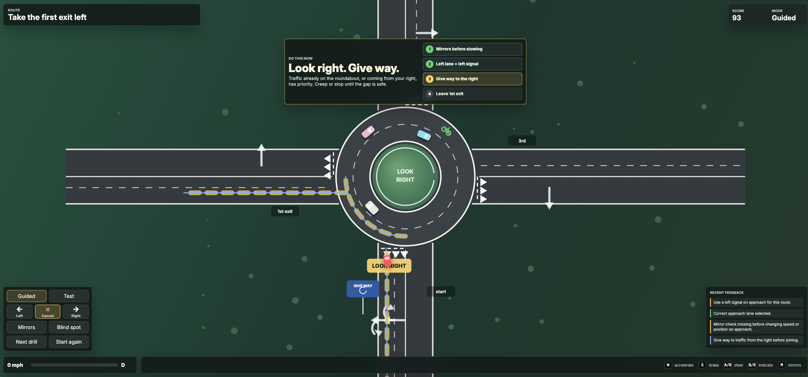

# UK Roundabout Trainer

A 2D, top-down web simulation built to help driving students master lane discipline, signalling rules, and give-way priorities at typical UK two-lane roundabouts. 

Built using **Vanilla JavaScript and HTML5 Canvas** with zero external dependencies.

<p align="center">
  
</p>

---

---

## 🛠️ Features

* **Interactive Scenarios:** Covers multiple real-world roundabout objectives:
  * Taking the 1st exit (Left)
  * Taking the 2nd exit (Straight Ahead)
  * Taking the 3rd exit (Right)
  * Full-circle loop drills
* **Dual Game Modes:**
  * **Guided Mode:** Features real-world coaching advice, directional paths, and real-time visual "tags" highlighting exactly what action to take next.
  * **Test Mode:** Quieter UI requiring the driver to make decisions independently while progress is still actively tracked.
* **Smart Driving Instructor Logic:** Evaluates UK highway code habits on the fly, including:
  * Dynamic mirror and blind spot logging.
  * Correct approach lane entry.
  * Precision exit signalling (timing the indicator *after* passing the previous exit).
  * Give-way checks for oncoming traffic coming from the right.
* **Physics & AI Traffic:** Includes keyboard-driven car handling (acceleration, braking, steering) alongside procedural scenery and dynamic AI vehicles (cars, vans, and cyclists).

---

## 🎮 How to Play

### Controls
| Key | Action |
| :--- | :--- |
| <kbd>W</kbd> / <kbd>↑</kbd> | Accelerate |
| <kbd>S</kbd> / <kbd>↓</kbd> / <kbd>Space</kbd> | Brake / Reverse |
| <kbd>A</kbd> / <kbd>D</kbd> / <kbd>←</kbd> / <kbd>→</kbd> | Steer Left / Right |
| <kbd>Q</kbd> | Indicate Left |
| <kbd>E</kbd> | Indicate Right |
| <kbd>X</kbd> | Cancel Indicators |
| <kbd>M</kbd> | Check Mirrors |
| <kbd>B</kbd> | Check Blind Spot |
| <kbd>N</kbd> | Next Drill Scenario |
| <kbd>R</kbd> | Restart Current Drill |

### The Scoring System
You start each module with a perfect **100 score**. Mistakes like striking a kerb, cutting off a cyclist, choosing the wrong lane, or missing a mirror check deduct points instantly. Good habits earn streak multipliers!

---

## 📦 Local Installation

Because the codebase runs entirely on native web APIs, you don't need `npm`, build tools, or complex setups.

1. **Clone the repository:**
   ```bash
   git clone [https://github.com/adwaitsharma/UK_driving_test_simulator.git](https://github.com/adwaitsharma/UK_driving_test_simulator.git)
